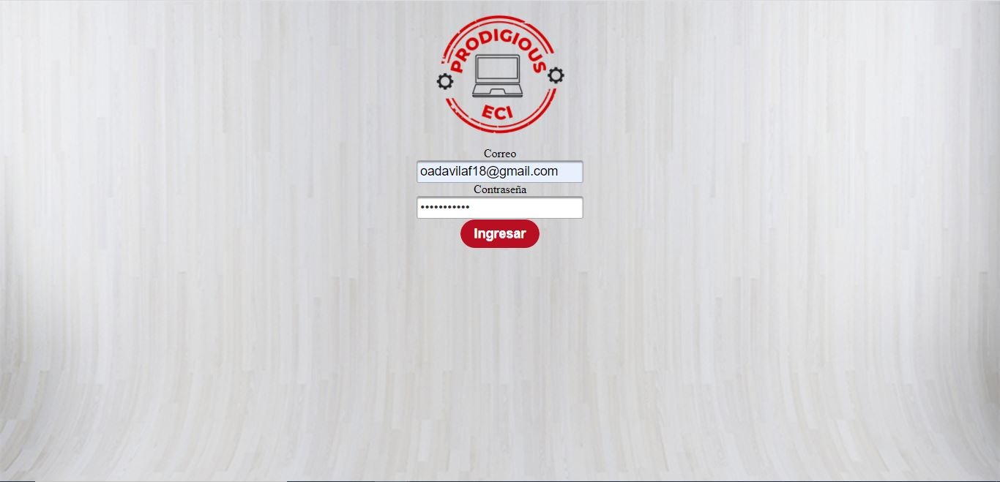
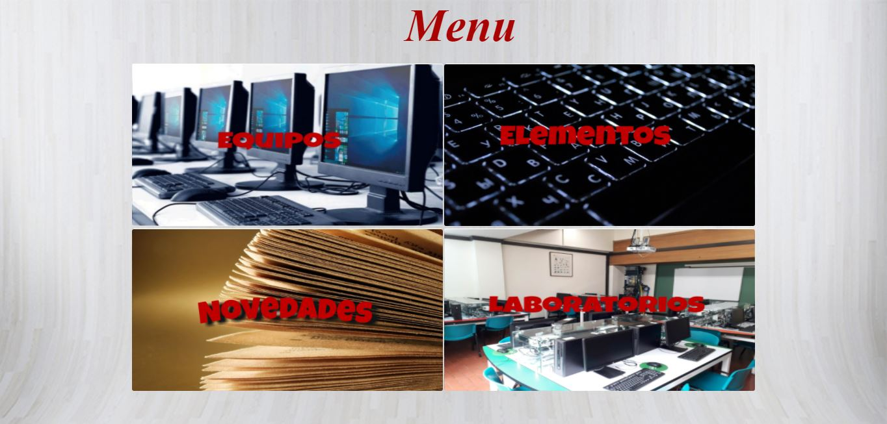

# HistorialEquiposCVDS

**Nombre del curso:**
 
**Integrantes:**

  * Javier Esteban Lopez
  * Yarit Yajanny Villalobos 
  * Andres Felipe Davila
  * Miguel Angel Fuquene

**Profesores:**

  * Julian Mauricio Velasco
  * Oscar David Ospina

**Roles asignados:**

  * **Julian Mauricio Velasco:** Dueño de producto 
  * FALTA(PONGAMONOS ROLES)
  
### Descripción del proyecto

  * **Descripcion General:** 
    
  * **Manual de Usuario:**
    
    El inicio de sesion, donde el usuario es el correo electronico
    
    
    
    Se abrira un menu donde se encuentran 4 opciones
    
    
    
      - **Equipos:** Aqui se puede consultar y registrar equipos, además se puede asociar equipos a los laboratorios.    
      - **Elementos:** Aqui se puede consultar y registrar elementos, además se puede asociar elementos a equipos.  
      - **Novedades:** Aqui esta el historial de todas las novedades de cada elemento, equipo y laboratorio
      - **Laboratorios:** Aqui se puede consultar y registrar laboratorios.
  # Equipos:
    
  # Elementos:
  # Novedades:
  # Laboratorios:
  
  
### Arquitectura y Diseño Detallado

  * **Modelo E-R:**
  * **Diagrama de clases:**
  * **Descripción de la arquitectura y el Stack de tecnologías utilizado:**
  * **Enlace a la aplicacion en Heroku:** https://historialequipos.herokuapp.com/faces/Autenticacion.xhtml
      
  * **Enlace al sistema de integración continua**
### Descripción del proceso:

  * **Integrantes:**
  * **Breve Descripción de Metodoloía:**
  * **Enlace a Taiga:**
  * **Release-burndown chart y puntos de historias realizadas y faltantes**
  * **Sprints**
  * **Pruebas:**
  * **Reporte de Analisis estático de código**

### Circle CI

