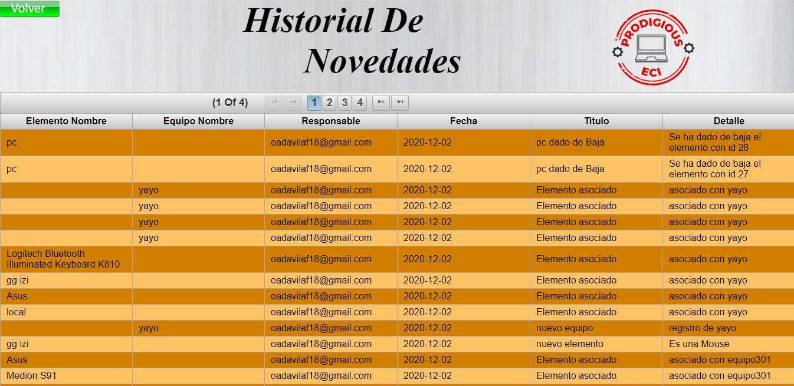

# HistorialEquiposCVDS

**Nombre del curso:** Ciclos de Vida del Desarrollo De Software
 
**Integrantes:**

  * Javier Esteban Lopez
  * Yarit Yajanny Villalobos 
  * Andres Felipe Davila
  * Miguel Angel Fuquene

**Profesores:**

  * Julian Mauricio Velasco
  * Oscar David Ospina

**Roles asignados:**

  * **Julian Mauricio Velasco:** Dueño de producto 
  * **Javier Esteban Lopez:** Desarrollador
  * **Yarit Yajanny Villalobos:** Desarrollador
  * **Andres Felipe Davila:** Desarrollador
  * **Miguel Angel Fuquene:** Carreado :v
  
### Descripción del proyecto

  * **Descripcion General:**  
    
  * **Manual de Usuario:**
    
    El inicio de sesion, donde el usuario es el correo electronico
    
    
    
    Se abrira un menu donde se encuentran 4 opciones
    
    
    
      - **Equipos:** Aqui se puede consultar y registrar equipos, además se puede asociar equipos a los laboratorios.    
      - **Elementos:** Aqui se puede consultar y registrar elementos, además se puede asociar elementos a equipos.  
      - **Novedades:** Aqui esta el historial de todas las novedades de cada elemento, equipo y laboratorio
      - **Laboratorios:** Aqui se puede consultar y registrar laboratorios.
  # Equipos:
Para poder registrar un equipo se tienen que llenar los campos, y darle en el boton registrar equipo.

En la tabla van a estar unicamente los equipos que estan activos y se podra ordenar por Id, Nombre, equipos Activos y por nombre de Laboratorios, Cada color en la tabla tiene el significado de disponibilidad.(verde->Equipos disponibles y no estan asignados a un laboratorios, amarillos -> Equipos activos y estan asignados a un laboratorio, rojos -> Equipos dados de baja), al dar en la pestaña "Todos los Equipos" se veran los equivos activos y desactivos, se pueden seleccionar varios equipos y en la parte superior derecha de la tabla se verá una caneca, donde indica que va a dar de baja estos equipos.
Debajo de la tabla estara el botón de descargar, donde se podra descargar la tabla presente.

Al frente de cada fila de equipo, se podra ver un link "Ver Equipo", que los llevara a la información del equipo y tambien estará la opción para registrar una nueva novedad.

En la primera tabla se podrá ver las novedades de ese equipo, ordenadas de la más reciente a la mas antigua. Debajo de la tabla estara el botón de descargar, donde se podra descargar la tabla presente.

  # Elementos:
  Para poder registrar un elemento se tienen que llenar los campos, y darle en el boton registrar elemento.
  
  
  
En la tabla se encontraran todos los elementos y se pdran ordenar por Id,Tipo,Nombre,Dado de baja,Equipo asociado. Cada color en la tabla tiene el significado de disponibilidad.(verde->Elementos disponibles y no estan asignados a un equipo, amarillos -> Elementos activos y estan asignados a un equipo, rojos -> Elementos dados de baja), se pueden seleccionar varios elementos y en la parte superior derecha de la tabla se verá una caneca, donde indica que va a dar de baja estos eelementos.
Debajo de la tabla estara el botón de descargar, donde se podra descargar la tabla presente.
 

Al frente de cada fila de elemento, se podra ver un link "Ver Elemento", que los llevara a la información del elemento y tambien estará la opción para registrar una nueva novedad de ese elemento.

  
 En la primera tabla se podrá ver las novedades de ese elemento, ordenadas de la más reciente a la mas antigua. Debajo de la tabla estara el botón de descargar, donde se podra descargar la tabla presente.
 
 
 
 En la segunda tabla se podra asociar elementos a equipos, el elemento que estaba en uso por el equipo seleccionado quedará disponible para uso y será remplazado por el respectivo elemento.
 
  
 
  # Novedades:
  Aquí se podrá ver todas las novedades de todos los elementos,quipos y laboratorios. Estaran ordenas de la mas reciente a la mas antigua.
  
  
  
  # Laboratorios:
  
  
### Arquitectura y Diseño Detallado

  * **Modelo E-R:**
  * **Diagrama de clases:**
  * **Descripción de la arquitectura y el Stack de tecnologías utilizado:**
  * **Enlace a la aplicacion en Heroku:** https://historialequipos.herokuapp.com/faces/Autenticacion.xhtml
      
  * **Enlace al sistema de integración continua**
### Descripción del proceso:

  * **Integrantes:**
  * **Breve Descripción de Metodoloía:**
  * **Enlace a Taiga:** https://tree.taiga.io/project/javier200151-historial-de-equipos-labinfo-1/backlog?milestone=276704
  * **Release-burndown chart y puntos de historias realizadas y faltantes**
  * **Sprints**
  * **Pruebas:**
  * **Reporte de Analisis estático de código**

### Circle CI

